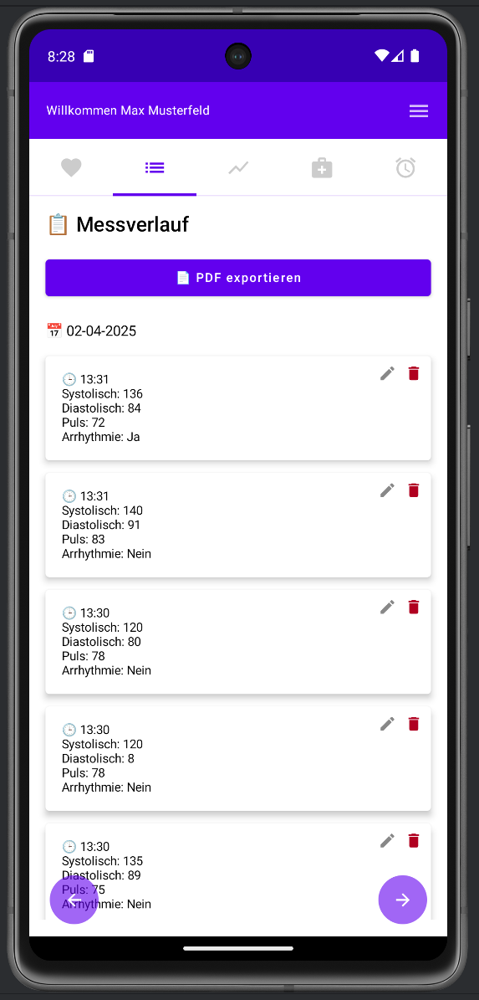
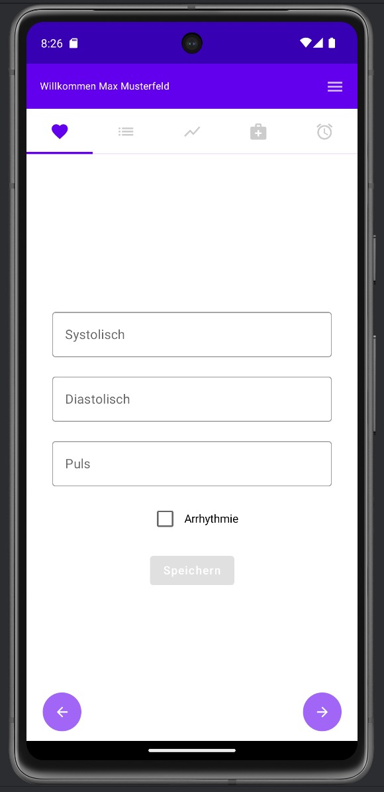
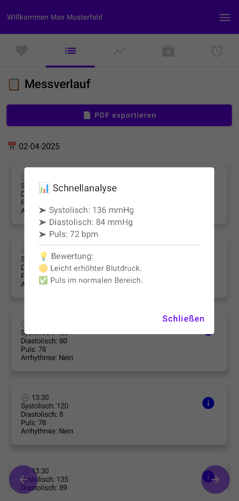
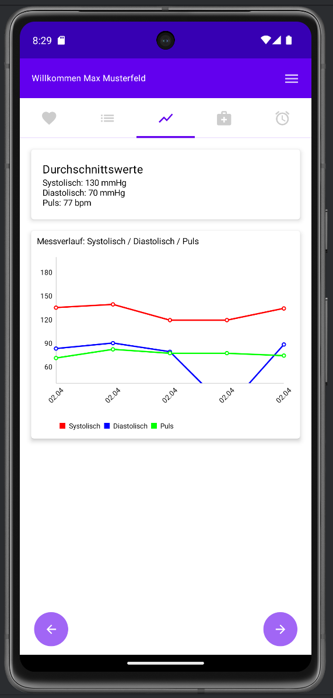
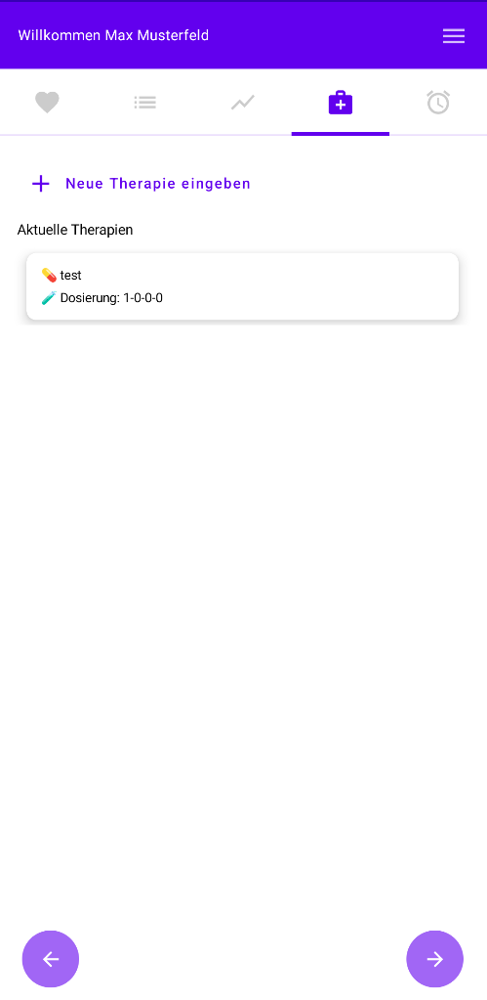
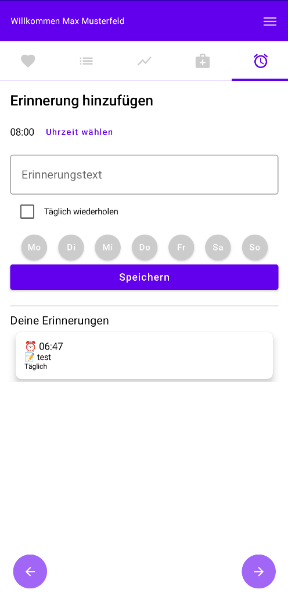

# 🩺 RRmedApp

**RRmedApp** ist eine moderne Android-App zur Verwaltung von Blutdruckmessungen, Therapieplänen und Erinnerungen – ideal für Menschen, die ihre Gesundheit im Blick behalten möchten.

---

## ✨ Funktionen

- ✅ **Benutzerverwaltung**  
  Mehrere Nutzerprofile für unterschiedliche Personen.

- 🩸 **Blutdruckmessungen verwalten**  
  Speicherung von systolischem, diastolischem Wert, Puls und Arrhythmie.

- 🩺 **Schnellanalyse**
  Die Schnellanalyse-Funktion bietet dir eine sofortige Einschätzung deiner gemessenen Werte (systolisch, diastolisch, Puls). Mit einem einfachen Tipp auf das ℹ️-Icon oben rechts in jeder Messkarte öffnet sich ein Dialog, der deine Werte individuell bewertet.

- 📊 **Statistiken & Grafiken**  
  Übersichtliche Darstellung von Messverläufen und Durchschnittswerten.

- 💡 **Therapie-Management**  
  Medikamente & Dosierungen bequem eingeben, bearbeiten und löschen.

- ⏰ **Erinnerungen mit Alarm-Funktion**  
  Wiederholbare Erinnerungen mit Zeit- und Tagesauswahl (inkl. Benachrichtigungen).

- 🧾 **PDF-Export der Messwerte**  
  Exportiere deine Werte als übersichtliches PDF-Dokument.

  ## 🔁 Datenexport & Import

- 📤 **Export**
  Alle Nutzerdaten (User, Messwerte, Therapien, Erinnerungen) können als `.json` exportiert und geteilt werden
  
- 📥 **Import**
  Backup-Dateien im JSON-Format können importiert werden, inkl. Nutzerzuordnung


---

## 📱 Screenshots

<p float="left">
  
  
  
</p>

<p float="left">
  
  
  
</p>

---

## 🛠️ Technologien

- [Kotlin](https://kotlinlang.org/)
- [Jetpack Compose](https://developer.android.com/jetpack/compose)
- [Room Database](https://developer.android.com/jetpack/androidx/releases/room)
- [MPAndroidChart](https://github.com/PhilJay/MPAndroidChart)
- AlarmManager, NotificationManager

---

## 🚀 Installation

1. Klone das Repository:

```bash
git clone https://github.com/gelovI/RRmedApp.git
